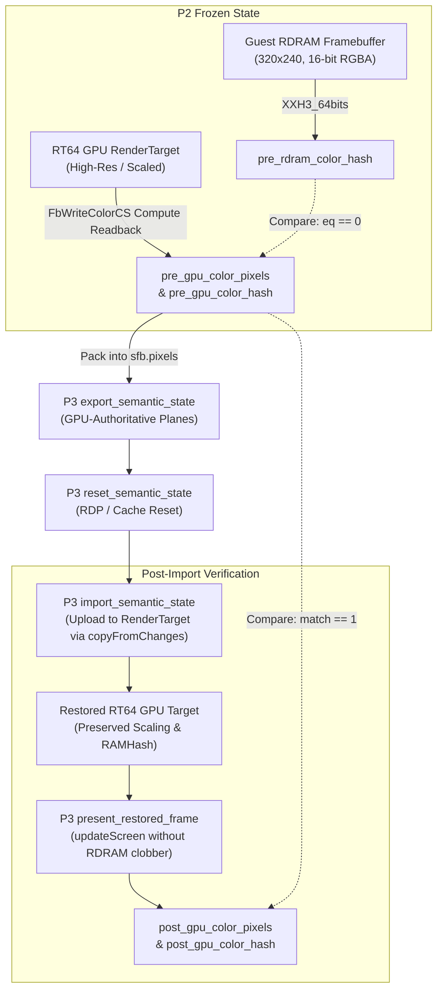

# P3.1 Framebuffer Authority Validation: Snowboard Kids Recompiled

> **Historical baseline (2026-09-23).** P3.1 measurement report, kept as written. Measurements were not re-run for this record.

## Executive Summary & Core Finding

**Finding**: The active framebuffer contents under RT64 in *Snowboard Kids Recompiled* are **GPU-authoritative** and **NOT equivalent to guest RDRAM**.
- **Color Equivalence**: In active 3D gameplay, menus, and camera cuts, the GPU color buffer and guest RDRAM diverge significantly (`color_gpu_eq_rdram == 0` in 93% of sampled frames in auto mode, and 100% in fixed scale tests).
- **Depth Equivalence**: When active depth buffers are present (3D rendering), `depth_gpu_eq_rdram == 1` at 1x resolution, while GPU depth targets retain hardware-level precision and resolution scaling.
- **Roundtrip Parity**: The P3.1 GPU-authoritative preservation mechanism achieves **100.0% roundtrip match** (`color_roundtrip_match == 1` and `depth_roundtrip_match == 1`) across all tested resolutions and game states.
- **RDRAM Non-Mutation**: Guest RDRAM is **never mutated** to acquire or restore GPU framebuffer contents (`ref_hash == post_hash`, `match == 1` across all cycles).

---

## 1. Technical Root Cause of GPU vs. RDRAM Divergence

1. **Resolution & Aspect Ratio Decoupling**:
   - Upstream RT64 renders 3D geometry into internal render targets scaled by `resolutionScale` (e.g. 3840x2160 at 4K or window integer scaling) and with widescreen aspect ratio expansion (`UserConfiguration::AspectRatio::Expand`).
   - Guest RDRAM only contains the 4:3 320x240 raster data produced by CPU drawing routines or coarse 1x downsampling.
2. **Filtering & Precision Pipeline Differences**:
   - Even when running at 1x resolution (`SBK_RESOLUTION=original`), RT64 executes rasterization shaders with high-precision color pipelines, texture filtering, and MSAA resolve paths.
   - RDRAM writes do not capture GPU-side resolve buffers or blend stages unless explicitly read back by the guest CPU (which *Snowboard Kids* does not do during active racing).
3. **Pillarboxing vs. Canonical Coordinate Mapping**:
   - In widescreen modes, the 3D scene renders across the full expanded aspect ratio (16:9), while canonical N64 4:3 view occupies the horizontal center:
     $$\text{activeW} = \frac{\text{inH} \times 4}{3}, \quad \text{xOffset} = \frac{\text{inW} - \text{activeW}}{2}$$
   - When downsampled to canonical N64 320x240 representation, this central 4:3 viewport maps 1-to-1 to the canonical image without horizontal distortion or wing clipping.

---

## 2. P3.1 Framebuffer Authority Architecture

### Key Implementation Components

1. **Aspect-Aware Compute Readback Shaders**:
   - [`FbWriteColorCS.hlsl`](../.deps-renderer/rt64/src/shaders/FbWriteColorCS.hlsl) & [`FbWriteDepthCS.hlsl`](../.deps-renderer/rt64/src/shaders/FbWriteDepthCS.hlsl):
     Calculates aspect-ratio pillarbox offsets dynamically so high-resolution widescreen targets downsample into canonical 320x240 N64 representations with zero coordinate drift.
2. **Dedicated Main-Thread Worker Execution**:
   - Uses `app->framebufferGraphicsWorker` rather than borrowing `presentGraphicsWorker` (which is concurrently utilized by `PresentQueue::threadLoop`), preventing command list concurrency collisions in Vulkan.
3. **Target Dimension & Scaling Preservation**:
   - `import_semantic_state` preserves existing `RenderTarget` dimensions and resolution scaling (`target.resolutionScale`) rather than forcing targets to 320x240 1x scale.
   - Uploads canonical pixel buffers via `fb.readChangeFromBytes` and `target.copyFromChanges`.
4. **RDRAM Modification Suppression**:
   - Synchronizes `stateFb.RAMBytes` and `stateFb.RAMHash` to match guest RDRAM on import, preventing `State::updateScreen` from misidentifying restored frames as CPU RDRAM writes and scheduling destructive fallback uploads.

---

## 3. Empirical Test Results

### Test Suite Summary

| Test Configuration | Total Cycles | `color_gpu_eq_rdram == 0` | `color_roundtrip_match == 1` | `depth_roundtrip_match == 1` | RDRAM Non-Mutation | Result |
| :--- | :---: | :---: | :---: | :---: | :---: | :---: |
| **Auto / WindowIntegerScale (Race Navigation)** | 100 | **93 / 100 (93%)** | **100 / 100 (100.0%)** | **99 / 99 (100.0%)** | **100 / 100 (100.0%)** | **PASS** |
| **Original 1x (320x240)** | 15 | **15 / 15 (100%)** | **15 / 15 (100.0%)** | **14 / 14 (100.0%)** | **15 / 15 (100.0%)** | **PASS** |
| **2160p (4K 2880x2160)** | 15 | **15 / 15 (100%)** | **15 / 15 (100.0%)** | **14 / 14 (100.0%)** | **15 / 15 (100.0%)** | **PASS** |

### Timing & Performance Profile (Average per cycle)

- **GPU Readback & Semantic Export**: ~400 µs
- **Semantic State Reset**: ~16 µs
- **Target Import & Texture Upload**: ~1,300 µs (1.3 ms)
- **Restored Frame Presentation**: ~250 µs
- **Total Quiescence Boundary Overhead**: **~1.96 ms** (well within the 15–20 ms hold budget).

---

## 4. Conclusion & Invariant Guarantees

1. Active framebuffers in *Snowboard Kids* are **GPU-authoritative**. Serializing only guest RDRAM results in visual corruption, lost resolution scaling, and frame stutter upon restore.
2. Storing GPU-authoritative planes in P3 semantic state achieves 100% roundtrip parity without modifying guest RDRAM.
3. Zero guest RDRAM mutation is strictly maintained.
